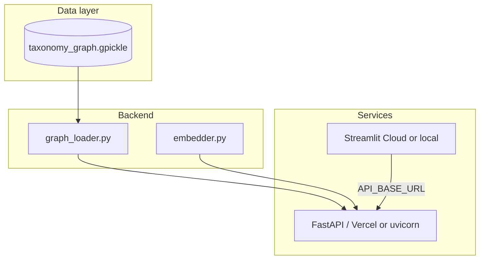

# MetaML Taxonomy Knowledge Graph

**Semantic search, graph exploration, and text classification over a MetaML taxonomy — powered by a NetworkX knowledge graph and sentence embeddings.**

[](https://www.python.org/)
[](https://fastapi.tiangolo.com/)
[](https://streamlit.io/)

---

## Suggested GitHub repository names

Pick one that highlights the **knowledge graph + taxonomy** focus:

| Name | Best for |
|------|----------|
| **`metaml-taxonomy-knowledge-graph`** | Clear, professional (recommended) |
| `taxonomy-kg-semantic-rag` | Emphasizes KG + RAG |
| `kg-metaml-taxonomy-explorer` | Emphasizes exploration UI |
| `metaml-kg-rag-taxonomy-api` | API-first / portfolio |

---

## What this project does

This repo implements a **RAG-style taxonomy system** for MetaML:

| Use case | Feature | Endpoint / UI tab |
|----------|---------|-------------------|
| **UC1** | Semantic search over taxonomy areas | `POST /search` |
| **UC2** | Knowledge graph explorer (nodes, neighbors, subtree) | `GET /node`, `/neighbors`, `/subtree` |
| **UC3** | Compare two areas (embedding + graph distance) | `POST /compare` |
| **UC4** | Classify free text into taxonomy paths | `POST /classify` |
| **UC5** | Coverage audit & semantic overlap detection | `GET /coverage`, `/overlaps` |

**Stack**

- **Knowledge graph:** `networkx` digraph loaded from `data/taxonomy_graph.gpickle` (~648 nodes)
- **Embeddings:** `sentence-transformers` (`all-MiniLM-L6-v2`) over hierarchical area paths
- **API:** FastAPI (`index/api.py`)
- **UI:** Streamlit (`frontend/app.py`)



---

## Project structure

```
rag_metaml/
├── api/main.py              # Vercel serverless entry (re-exports FastAPI app)
├── backend/graph_loader.py  # NetworkX KG loader & graph helpers
├── data/taxonomy_graph.gpickle
├── frontend/app.py          # Streamlit UI
├── functions/embedder.py    # Embedding index & semantic ops
├── index/api.py             # FastAPI routes
├── requirements.txt         # Full local / Streamlit install
├── requirements-vercel.txt  # Slim API deps for Vercel
├── vercel.json              # Vercel deploy config
└── start.sh                 # Local API launcher
```

---

## Run locally

> Run all commands from the **repository root**, not from `frontend/`.

### 1. Install

```bash
git clone https://github.com/YOUR_USER/metaml-taxonomy-knowledge-graph.git
cd metaml-taxonomy-knowledge-graph

python3.10 -m venv .venv
source .venv/bin/activate   # Windows: .venv\Scripts\activate
pip install -r requirements.txt
```

### 2. Start the API (Terminal 1)

```bash
bash start.sh
# or: PYTHONPATH=. uvicorn index.api:app --reload --port 8000
```

Verify: [http://127.0.0.1:8000/health](http://127.0.0.1:8000/health) · Docs: [http://127.0.0.1:8000/docs](http://127.0.0.1:8000/docs)

### 3. Start the UI (Terminal 2)

```bash
streamlit run frontend/app.py
```

Open [http://localhost:8501](http://localhost:8501) and click **Check API**.

Optional remote API:

```bash
export API_BASE_URL=http://127.0.0.1:8000
streamlit run frontend/app.py
```

---

## Deploy to GitHub (step by step)

### Step 1 — Create the repo on GitHub

1. Go to [github.com/new](https://github.com/new).
2. **Repository name:** `metaml-taxonomy-knowledge-graph` (or your preferred name from the table above).
3. Description: *Knowledge graph + semantic RAG explorer for MetaML taxonomy data.*
4. Choose **Public** (or Private).
5. Do **not** add a README (this repo already has one).
6. Click **Create repository**.

### Step 2 — Push from your machine

```bash
cd /path/to/rag_metaml

git init
git add .
git commit -m "Initial commit: MetaML taxonomy knowledge graph API and Streamlit UI"
git branch -M main
git remote add origin https://github.com/YOUR_USER/metaml-taxonomy-knowledge-graph.git
git push -u origin main
```

Replace `YOUR_USER` and the repo name with yours. Use SSH if you prefer:

```bash
git remote add origin git@github.com:YOUR_USER/metaml-taxonomy-knowledge-graph.git
```

### Step 3 — Confirm on GitHub

Refresh the repo page — you should see `README.md`, `data/taxonomy_graph.gpickle`, `vercel.json`, and the app code.  
`.env` is gitignored and must **not** be pushed.

---

## Deploy to Vercel (API) — step by step

Vercel hosts the **FastAPI backend only**. The Streamlit UI cannot run on Vercel (it needs a long-lived process); host the UI on **[Streamlit Community Cloud](https://share.streamlit.io)** (free) and point it at your Vercel API URL.

### Before you start

| Requirement | Why |
|-------------|-----|
| GitHub repo pushed | Vercel imports from Git |
| `data/taxonomy_graph.gpickle` committed | API loads the KG at runtime |
| Vercel **Pro** (recommended) | 60s timeout + 3 GB RAM for first embedding load |
| Expect a **slow first search** | Model + 622 embeddings build on first semantic request |

### Step 1 — Import project on Vercel

1. Sign in at [vercel.com](https://vercel.com) (GitHub login works well).
2. Click **Add New… → Project**.
3. **Import** your `metaml-taxonomy-knowledge-graph` repository.
4. Framework Preset: **Other** (Vercel uses `vercel.json`).

### Step 2 — Build settings (should auto-detect)

| Setting | Value |
|---------|--------|
| **Root Directory** | `.` (repo root) |
| **Install Command** | `pip install -r requirements-vercel.txt` |
| **Output** | (leave default — serverless functions) |

`vercel.json` in the repo already sets rewrites, `VERCEL=1`, and function limits.

### Step 3 — Deploy

1. Click **Deploy**.
2. Wait for the build (first time may take several minutes due to ML dependencies).
3. Copy your production URL, e.g. `https://metaml-taxonomy-knowledge-graph.vercel.app`.

### Step 4 — Smoke test

```bash
# Graph loads immediately
curl https://YOUR-PROJECT.vercel.app/health

# First semantic call may take 30–60s (cold start + model)
curl -X POST https://YOUR-PROJECT.vercel.app/search \
  -H "Content-Type: application/json" \
  -d '{"query": "digital banking", "top_k": 3}'
```

Interactive docs: `https://YOUR-PROJECT.vercel.app/docs`

### Step 5 — Deploy Streamlit UI (companion)

1. [share.streamlit.io](https://share.streamlit.io) → **Create app** → select this repo.
2. **Main file path:** `frontend/app.py`
3. **Secrets** (⚙️ → Secrets):

```toml
API_BASE_URL = "https://YOUR-PROJECT.vercel.app"
```

4. Deploy. Your public demo is the Streamlit URL; the API stays on Vercel.

### If Vercel build fails

Common causes: **deployment size** (PyTorch / `sentence-transformers`) or **timeout** on Hobby plan.

**Fallback (recommended for production API):** deploy the same start command on [Render](https://render.com) using `render.yaml` in this repo — see [DEPLOYMENT.md](./DEPLOYMENT.md).

---

## Environment variables

| Variable | Where | Description |
|----------|--------|-------------|
| `API_BASE_URL` | Streamlit | Public API base URL (no trailing slash) |
| `VERCEL` | Vercel (auto) | Skips eager embedding build at startup |
| `GRAPH_CACHE_PATH` | API | Optional override for `.gpickle` path |

---

## API reference (quick)

| Method | Path | Description |
|--------|------|-------------|
| `GET` | `/health` | Status, graph stats, embedder stats |
| `POST` | `/search` | UC1 semantic search |
| `GET` | `/node/{id}` | UC2 node detail |
| `GET` | `/neighbors/{id}` | UC2 neighbors |
| `GET` | `/subtree/{id}` | UC2 subtree |
| `POST` | `/classify` | UC4 text classification |
| `POST` | `/compare` | UC3 similarity |
| `GET` | `/coverage` | UC5 dimension coverage |
| `GET` | `/overlaps` | UC5 semantic overlaps |

---

## Development notes

- Original RAG pipeline (MySQL → Chroma) lives under `src/rag_metaml/` and `scripts/`.
- The **demo API/UI** uses the prebuilt pickle graph + in-memory embeddings (no live DB required).
- Rebuild graph data with your existing scripts, then copy the pickle to `data/taxonomy_graph.gpickle`.

---

## License

Add your license here (e.g. MIT) if you open-source the repo.

---

## Author

MetaML internship / side project — taxonomy knowledge graph + semantic retrieval.
